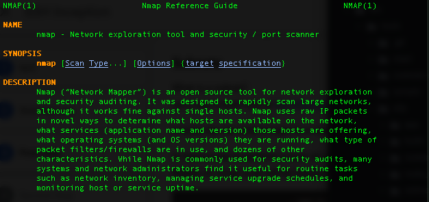
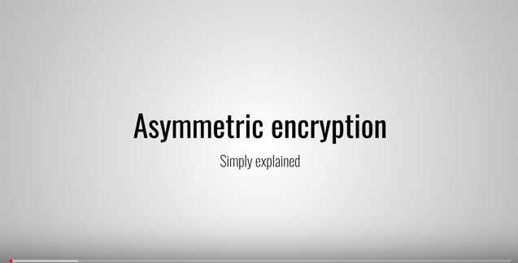

summary: SSH Inception
id: ssh-inception
tags: edurange
status: inProgress
authors: Selena

# SSH Inception

<!-------------------->
## NAT
Duration: 2

### Welcome to SSH Inception.

10.0.0.5 is one of many private IP addresses provided.

Learn how to use SSH via the command line to jump to different
levels.

[Understanding Secure Shell encryption](https://www.digitalocean.com/community/tutorials/understanding-the-ssh-encryption-and-connection-process) will help you complete this first task.

IMPORTANT NOTE: Every stop of the journey after the NAT instanc eocnatins a file named "secret". This contains the secret code you should enter into cloud.edurange.org for each stop along the way.

To view the contents of the file:

<!-- ------------------------ -->
## Starting Line
Duration: 2

### Man Pages & SSH: Basic Usage

Utilizing and deciphering man pages inside the command line will be an essential skill to complete these challenges.

To find detailed instructions about each command, type "man <command>" where "command" is the command you wish to learn more about.

Try typing "man ssh"

... and you should see something like this.

Underneath the Synopsis is a list of different flags and options you can enter with each command. A flag is a letter with a "-" in front. Each flag provides options to help specify the needs of your task.

Some examples commands using flags:

Can you figure out what these commands mean?

Are there any helpful flags or options on the ssh man page, perhaps relating to ports?

<!-- ------------------------ -->
## First Stop
Duration: 5

### Subnets

[What is a subnet?](https://whatismyipaddress.com/subnet).

It looks like we need to login to a new IP in our subnet.

Is there a way to perform a scan of our subnetwork to see what IP addresses are available? Maybe an nmap scan will be helpful?

Again, let's look underneath the Synopsis. It looks like we can use the command nmap followed by the  target we wish to scan.

What is our target? The subnet, or in other words your local network. Hint: we revealed it in the NAT instance message!

After this command, can you tell what you're looking at? A list of all the IP addresses in your subnet along with information about the services they provide and the status of those services.

Find an IP  that's a few addresses higher than your current address. Login using SSH.

(Hint: If you don't know or you forgot your current IP address, you can always type ifconfig to see your current IP)

<!-- ------------------------ -->
## Second Stop
Duration: 6

### Public/Private Key Encryption (RSA)

Use the list command to see all accessible files in your current directory. Check the contents of id_rsa using vim or cat. What are you looking at?

Having a foundational understanding of RSA encryption will be helpful to understand how you will get to the next stop.

Let's go back to the SSH man page.

You can search a man page by typing / and then the keyword you're searching for. Typing N will take you to the next search result.

Maybe there is a flag that will allow you to pass a file containing a private key to the next ip address?

(Hint: perform another nmap scan of the subnet to find the next IP address)

<!-- ------------------------ -->
## Third Stop
Duration: 5

### Searching your local filesystem

There are a few different commands for searching your local file system.

Grep, locate and find.

It's time to skim these man pages and start some searches of the file system. There are a few different ways to find the file we're looking for.

The find command is good if you are looking for a file of a particular name or file type. The grep command has many more possibilities and options to create specific searches. It's better for searching for a specific pattern or keyword.

The file containing the password to the next level is clearly marked. What keywords might be in the name of that file?

Ok, so you found the password and the next IP address, you used an nmap scan to find the next IP ... but when you try to login, you are blocked.

Is there another IP address you can SSH from?

<!-- ------------------------ -->
## Fourth Stop
Duration: 7

### FTP

FTP, or File Transfer Protocol, is a standard way to securely move files in a network. From your current address, you will connect to this FTP server which is hosted by another IP on your subnet. Make sure to look at the FTP man page for more information.

Again, scan the local network using nmap.

- When you find the address containing an open FTP server, simply type ftp and then the name of the IP Address you wish to connect with.

- Looks like you need a username and password to enter the FTP connection. To solve this riddle, search "ftp" inside the man page for nmap and read very carefully for the clue you're searching for.

- Inside the ftp connection, you can use the list command to see the contents of the server. Type "help" to view the other commands you have access to. Do any of them look useful for getting the file from 10.0.0.16 to your current address?

- After getting the file from the FTP server, try viewing the file contents with cat or vim. Within this file is a password you will need to run the program decryptpassword.

The decryptpassword file is [encrypted.](https://en.wikipedia.org/wiki/Encryption) Run the file like this:

Use the IP address you received from the FTP server and the password you recieved from running decryptpassword to get to the Fifth Stop.

<!-- ------------------------ -->
## Fifth Stop
Duration: 5

### Can you decode betcha_cant_read_me?

Start by looking at the helpful commands. There's one you haven't seen in this exercise before.

Use that command to perform an in depth search of the man pages using a keyword that will help you decode the file.

(HINT: try a few of the different commands returned in your search. Read their man pages carefully and see if any flags or options will be helpful. You will know you successfully decoded betcha_cant_read_me when you see the directions to the next stop printed on your console.)

<!-- ------------------------ -->
## Satan's Palace
Duration: 2

### Escape Satan's Palace to Become the Ultimate SSH Master

During your nmap scans, do you remember seeing any hosts that looked .... sinister?

If you don't recall, perform another scan. If you're brave, try using ssh and with a port specification to enter the palace.

Let's go back to the SSH man page.

Look carefully at all the flags and options under Synopsis. The last two are pertinent to our task.

This is a good opportunity to prove you understand how to use flags and options found on the man pages.

So you found the secret..... It's gibberish. It doesn't make any sense.
Perhaps we have to decode again?

Let's consider a classic form of ciphering.

[Caesear Cipher](https://en.wikipedia.org/wiki/Caesar_cipher)

It would be an awful lot of work to figure out what rotation this has been encrypted with. Let's just use one of the many decyphering tools online.

[Try this one.](https://cryptii.com/pipes/caesar-cipher)

Once your SSH Master title has been earned, submit your proof inside your browser opened to cloud.edurange.org!
